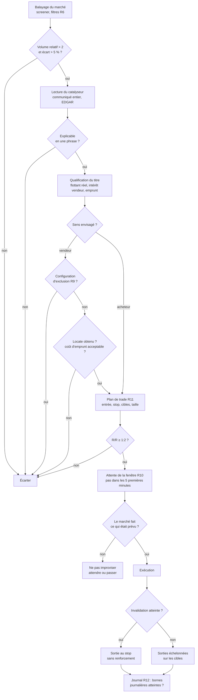

# Logique de décision

L'enchaînement complet, du balayage du marché à la clôture de la position.
Chaque étape est un **filtre** : elle élimine, elle ne confirme pas. Un
candidat qui traverse tout est un candidat, pas une certitude.

Les règles citées (R1…R13) sont dans [01-regles.md](01-regles.md).

## Le pipeline

## Les quatre points de rupture

Où l'enchaînement casse en pratique, et ce qui le tient.

**1. Le catalyseur lu au titre plutôt qu'au contenu.** Le titre d'un communiqué
et son effet réel divergent régulièrement. Le test de la phrase unique (R11)
est le garde-fou : on ne peut pas résumer en une phrase ce qu'on n'a pas lu.

**2. La configuration d'exclusion ignorée (R9).** Le point le plus coûteux, et
le seul absent de la pratique filmée. Une configuration de vente à découvert
qui paraît idéale — titre survolté, flottant réduit — est aussi celle où les
vendeurs se font écraser. Ce filtre s'applique **avant** de construire la
thèse, pas après l'avoir aimée.

**3. La taille calculée après l'entrée.** Inverse l'ordre de R1 et produit
mécaniquement la faute suivante : une position trop grosse fait ignorer son
propre stop.

**4. Le renforcement à contre-courant.** Le mécanisme d'échec documenté par la
chaîne. Attendre un repli pour ajouter ressemble à de la patience et est un
refus de constater. R5 l'interdit structurellement : le stop ne se déplace pas,
donc la question ne se pose pas.

## Ce que la logique optimise

Trois écarts entre la pratique filmée et l'enchaînement ci-dessus, par ordre de
gain attendu :

| Écart observé | Correction | Effet |
|---|---|---|
| Aucun filtre d'exclusion vendeur | R9 avant la thèse | Évite la classe d'échec la plus destructrice |
| Décisions prises en séance | R11 avant l'ouverture | Déplace la décision hors de l'exposition |
| Sortie par distraction | Cibles définies au plan | Supprime le motif de sortie non méthodique |

Le premier est structurel, les deux autres sont procéduraux. C'est le premier
qui compte : les deux autres améliorent l'exécution d'une thèse, le premier
empêche de prendre une thèse qui n'aurait pas dû l'être.

## Boucle de rétroaction

Le pipeline n'est pas complet sans sa fermeture : chaque opération alimente le
journal, le journal alimente la révision des critères, et les bornes de perte
(R3, R4) peuvent suspendre le pipeline entier.

C'est ce qui distingue une méthode d'une collection d'astuces — le résultat
modifie les paramètres d'entrée du prochain cycle.
