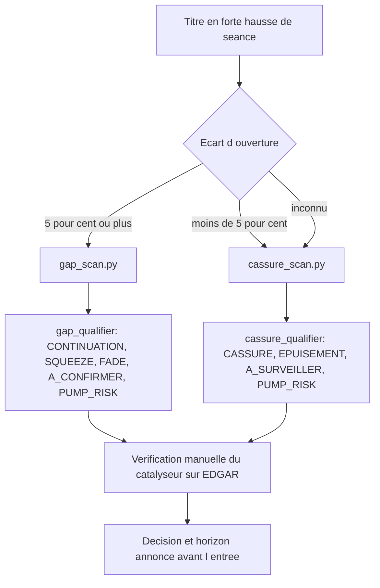

# Gaps et cassures : ce que les filtres laissent passer

## 1. Ce que la séance du 22 septembre 2026 a révélé

Un screener se juge autant sur ce qu'il rend que sur ce qu'il ne rend pas. La
seconde mesure est la plus difficile à obtenir, parce qu'elle demande de
reconstruire après coup la liste de ce qui aurait dû apparaître. La séance
américaine du 22 septembre 2026 a fourni cette liste : les vingt plus fortes
progressions de l'ouverture à la clôture, avec pour chacune l'écart d'ouverture
qui l'avait ou non précédée.

Le constat central tient en une phrase. Sur les dix premières places, huit
titres n'avaient pas gappé. INDP, la plus forte hausse du jour avec 28,7 % de
l'ouverture à la clôture, avait ouvert à 0,3 % de la clôture de la veille. AVAT,
DNA et FEAM avaient ouvert en baisse. Ces titres ne sont pas des gaps ratés :
ce sont des cassures intraday, une configuration que le screener de gaps ne peut
pas voir puisque son filtre le plus structurant porte précisément sur l'écart
d'ouverture.

Deux titres seulement validaient le schéma complet du gap continué : MAZE, avec
un écart d'ouverture de 9,5 % suivi de 15,7 % en séance, et STFS, avec 7,2 %
puis 17,7 %. STFS devait être écarté, et l'a été : 45 000 titres échangés dans
la journée placent le titre très en dessous du plancher de liquidité de la
méthode, et le gain de 26 % qu'il affiche est inexploitable parce que l'écart
entre le prix acheteur et le prix vendeur absorberait la position.

Restait MAZE. Le titre validait tout : écart d'ouverture franc, volume
explosif, progression continue jusqu'à la clôture. Le screener ne l'a pas rendu.
Comprendre pourquoi a conduit aux quatre révisions décrites dans ce chapitre.

### 1.1 Les chiffres de MAZE, recalculés

Toutes les valeurs de ce chapitre proviennent des barres journalières
d'Interactive Brokers, heures de cotation régulières, et non du screener lui
même. Le point importe : vérifier un filtre avec la source que le filtre
utilise reviendrait à valider une mesure par elle-même.

| Mesure | Valeur |
|---|---|
| Clôture du 21.09.2026 | 22,39 |
| Ouverture du 22.09.2026 | 24,51 |
| Écart d'ouverture | +9,47 % |
| Clôture du 22.09.2026 | 28,38 |
| Progression de séance | +15,79 % |
| Progression totale | +26,75 % |
| Volume du jour | 2 726 280 titres |
| Volume médian sur trois mois | 195 817 titres |
| Volume moyen sur trois mois | 290 127 titres |
| Volume relatif du jour | 13,4 |
| ATR(14) avant le gap | 1,299, soit 5,80 % du cours |
| Taille du gap normalisée | 1,63 fois l'ATR |

Le dernier chiffre mérite un commentaire, parce qu'il montre que la
classification aurait fait son travail si le titre lui était parvenu. Au-delà de
1,2 fois l'ATR, la probabilité de comblement dans la journée tombe à environ
8 %. MAZE se situait à 1,63 fois l'ATR : la grille de qualification l'aurait
classé en continuation avec une confiance élevée. Le titre n'a jamais atteint
cette grille, parce que deux filtres situés en amont l'avaient déjà exclu.

## 2. La liquidité : la séance, pas la moyenne

### 2.1 Le défaut

Le premier filtre en cause exigeait un volume moyen supérieur à 500 000 titres.
MAZE en échange 290 127 en moyenne sur trois mois, et 195 817 en médiane. Le
titre était donc écarté avant tout examen.

Le seuil n'est pourtant pas arbitraire. Il vient de la formation, partie 7
chapitre 1, qui énonce qu'un volume quotidien moyen inférieur à 500 000 titres
constitue un risque pour le trading actif. Ce que la révision change n'est pas
le nombre, c'est la colonne à laquelle il s'applique.

Un raisonnement suffit à trancher. À quoi sert ce seuil ? À garantir qu'une
position puisse être prise et rendue sans payer un écart punitif. Or ce qui
permet d'exécuter, c'est le volume disponible le jour où l'on exécute, pas la
moyenne des trois mois précédents. MAZE a échangé 2 726 280 titres le
22 septembre : la liquidité réellement offerte ce jour-là dépassait de cinq fois
le seuil exigé.

Le raisonnement se vérifie sur le cas symétrique. STFS, avec ses 45 000 titres
échangés dans la journée, doit être écarté et l'est toujours sous la nouvelle
règle. Le critère déplacé conserve donc sa fonction d'origine tout en cessant
d'exclure le cas qu'il était censé retenir.

Il y a même un lien de cause à effet entre les deux mesures. C'est l'étroitesse
du flux ordinaire de MAZE qui produit un volume relatif de 13,4 le jour du
catalyseur. Filtrer sur la moyenne revenait ainsi à éliminer les titres chez qui
le signal recherché est le plus net.

### 2.2 La règle retenue

Deux tests distincts remplacent le test unique, parce qu'ils ne mesurent pas la
même chose.

| Test | Seuil | Ce qu'il protège |
|---|---|---|
| Volume du jour | 500 000 titres | L'exécution : entrer et sortir sans subir l'écart |
| Volume moyen | 100 000 titres | La sortie du lendemain : un titre habituellement mort reste difficile à revendre |

Le plancher structurel de 100 000 titres ne vient pas de la formation, et le
code le déclare comme tel. Il est délibérément bas pour ne pas recréer le filtre
que la première ligne corrige ; MAZE, avec 290 127 titres de moyenne, le passe
largement.

Une troisième règle complète le dispositif, et elle relève d'une convention
déjà établie dans le dépôt : un volume du jour inconnu ne vaut pas un volume
insuffisant. Lorsque la mesure manque, le titre n'est pas écarté ; l'absence est
signalée dans les inconnues du verdict. Confondre l'ignorance et la mesure
reviendrait à lire « personne ne traite ce titre » là où l'on sait seulement que
l'on n'a pas regardé.

### 2.3 La traduction dans le screener

Finviz distingue les deux colonnes, ce qui rend la correction directe :
`Current Volume` porte le plancher d'exécution, `Average Volume` le plancher
structurel.

## 3. Le plafond de prix et le filtre de short interest

### 3.1 Un plafond qui mesure autre chose que ce qu'il croit

Le second filtre qui excluait MAZE limitait le prix à 20 dollars. Le titre
cotait 22,39 avant son gap, et ouvrait à 24,51.

L'intention derrière ce plafond est claire : la méthode vise les petites
capitalisations, dont les mouvements sont amples. Mais le prix unitaire est un
mauvais indicateur de cette amplitude. MAZE, à 22 dollars, présentait un ATR de
5,80 % du cours, soit une volatilité largement suffisante pour la configuration
recherchée. Le plafond mesurait une chose et en filtrait une autre.

Trois raisons conduisent à le relever à 50 dollars plutôt qu'à le supprimer.
La capitalisation, plafonnée aux valeurs sous deux milliards de dollars, reste
le véritable contrôle du risque et elle n'a pas changé. La normalisation de
l'écart par l'ATR, déjà présente dans la qualification, mesure directement si un
gap est significatif pour le titre qui le produit. Enfin, conserver une borne
haute évite de remplir la liste de grandes valeurs dont un écart de 5 % relève
d'une autre mécanique de marché.

Aucun seuil de volatilité n'a été introduit à la place du plafond. La tentation
existait, mais le dépôt s'astreint à ne poser que des seuils dont l'origine est
citable, et la normalisation par l'ATR fait déjà ce travail sans nombre
supplémentaire.

### 3.2 Un filtre qui contredisait la classification

Le troisième écart est de nature différente : il ne s'agit pas d'un réglage mal
calibré mais d'une incohérence interne.

Le screener exigeait un short interest supérieur à 10 % du flottant, en
conjonction avec tous les autres critères. Or la classification, dans le même
skill, définit ses classes ainsi :

    SQUEEZE       short interest élevé AVANT le mouvement + volume progressif + catalyseur
    CONTINUATION  catalyseur haussier + RVOL >= 3 + cours au-dessus du VWAP

La classe `CONTINUATION` ne demande aucun short interest. Mais aucun titre ne
pouvait l'atteindre, puisque le filtre placé en amont exigeait ce short interest
de tous les candidats. Le screener était en pratique un détecteur de squeeze,
alors que la méthode revendique quatre classes et que la plus fréquente d'entre
elles était rendue inaccessible.

Le seuil de 10 % n'est pas supprimé : il reste actif dans la classification, où
il discrimine entre un squeeze et une continuation au lieu d'exclure l'un des
deux avant l'examen. Un critère qui sépare deux cas et un critère qui en
élimine un ne se placent pas au même endroit de la chaîne.

### 3.3 Les filtres avant et après

| Critère | Avant | Après | Motif |
|---|---|---|---|
| Capitalisation | Sous 2 Md$ | Sous 2 Md$ | Inchangé : contrôle du risque |
| Prix | Sous 20 $ | Sous 50 $ | MAZE cotait 22,39 avant son gap |
| Volume du jour | Absent | Au-dessus de 500 K | Décide de l'exécution |
| Volume moyen | Au-dessus de 500 K | Au-dessus de 100 K | Devient un plancher structurel |
| Volume relatif | Au-dessus de 2 | Au-dessus de 2 | Inchangé pour les gaps |
| Short interest | Au-dessus de 10 % | Retiré | Contredisait la classe `CONTINUATION` |
| Écart d'ouverture | Au-dessus de 5 % | Au-dessus de 5 % | Inchangé : définit la configuration |

## 4. Le volume relatif et le biais de tendance

### 4.1 Le dénominateur que le mouvement gonfle

Le volume relatif compare le volume du jour à une référence calculée sur les
séances précédentes. Le dépôt utilisait la médiane des vingt dernières séances,
un choix déjà réfléchi : une correction antérieure avait remplacé la moyenne par
la médiane après qu'un cas de production, VEEA, eut montré que deux séances
exceptionnelles suffisaient à écraser le ratio.

La séance du 22 septembre a révélé une faiblesse que ce correctif ne couvre pas.
INDP, plus forte hausse du jour, donnait un volume relatif de 1,99 sur les vingt
dernières séances : sous le seuil de 2 du screener, donc invisible. Le titre
montait pourtant depuis dix séances, de 1,22 dollar le 8 septembre à 3,99 le
22 septembre. Ses propres volumes des jours précédents, jusqu'à 7,4 millions de
titres, saturaient la fenêtre de référence.

Le passage à la médiane protège contre un pic isolé. Il ne protège pas contre un
changement de régime qui dure trois semaines. Le volume relatif devenait faible
au moment précis où le titre explosait, parce que le dénominateur avait été
relevé par le mouvement même qu'il devait détecter.

### 4.2 Une seconde base de comparaison

La correction consiste à mesurer un second volume relatif contre une base
antérieure à la tendance en cours, en l'occurrence les séances comprises entre
la soixantième et la vingtième avant aujourd'hui. La classification retient
ensuite le plus grand des deux ratios.

Le choix du maximum n'est pas une commodité : il se démontre sans risque. Sur un
titre dépourvu de tendance préalable, les deux mesures coïncident, donc la
seconde n'apporte rien et n'enlève rien. Sur un titre en tendance, la seconde
est la seule qui dise la vérité. Un verdict ne peut donc jamais être dégradé par
l'ajout de cette mesure, et un test le vérifie explicitement.

| Titre | Volume relatif sur 20 séances | Volume relatif sur base antérieure | Rapport |
|---|---|---|---|
| INDP, en tendance depuis dix séances | 1,99 | 11,34 | 5,7 |
| MAZE, sans tendance préalable | 13,45 | 14,38 | 1,07 |

Le rapport entre les deux mesures fournit gratuitement un indicateur de régime.
Au-delà de 2, le titre était déjà installé dans un volume élevé avant la séance
observée. Le seuil sépare les deux cas mesurés avec une marge confortable, et le
verdict mentionne explicitement lorsqu'il a été lu sur la base antérieure, de
sorte que la lecture reste traçable.

### 4.3 Ce que cela coûte

La fenêtre d'historique passe d'un mois à six mois. Le nombre d'appels réseau ne
change pas : l'enrichissement reste un unique appel groupé, conformément à la
contrainte de budget du dépôt. Seule la taille de la réponse augmente.

## 5. La seconde configuration : la cassure sans gap

### 5.1 Pourquoi un second screener et non un réglage du premier

Les huit titres du haut de classement qui n'avaient pas gappé ne relèvent pas
d'un filtre mal réglé. Ils relèvent d'une configuration différente. Retirer le
filtre d'écart d'ouverture du screener de gaps ne les ferait pas apparaître
correctement : cela produirait un screener qui mélange deux mécaniques et les
juge avec une grille conçue pour une seule.

La démonstration est immédiate. La qualification d'un gap repose sur une
probabilité de comblement, calculée à partir de la taille de l'écart rapportée à
l'ATR. Une cassure n'a pas d'écart d'ouverture. La colonne centrale de la grille
est vide, et toute valeur qu'on y placerait serait une invention.

### 5.2 L'arbitre propre à la cassure

Si une cassure ne se juge pas sur le comblement, sur quoi se juge-t-elle ? Sur
la position de la clôture dans l'amplitude de la séance. Une cassure achetée
jusqu'au coup de cloche termine dans le haut de son amplitude ; une cassure
distribuée termine dans le bas. Deux titres peuvent afficher la même progression
par rapport à la veille et présenter des configurations opposées.

La mesure se lit entre 0, clôture au plus bas du jour, et 1, clôture au plus
haut. Les deux cassures complètes de la séance donnent 0,94 pour INDP et 0,79
pour MAZE. Le seuil de confirmation est placé à 0,70, sous les deux avec une
marge, et le seuil d'épuisement à 0,40. Ces deux valeurs sont une calibration du
dépôt et non un chiffre de la formation ; le code le déclare à l'endroit où
elles sont définies.

Le miroir du 22 septembre confirme l'utilité du second seuil. LXEO avait gappé
de 5,6 % puis rendu 5,6 % de l'ouverture à la clôture. Même journée, même
marché, schéma inverse : la configuration s'était retournée en séance, et seule
la position de la clôture dans l'amplitude le dit.

### 5.3 Les classes retenues

| Classe | Condition | Horizon |
|---|---|---|
| `CASSURE` | Catalyseur, volume relatif au-dessus de 3, clôture au-dessus du VWAP et au-dessus de 70 % de l'amplitude | Jour, prolongeable à la semaine |
| `EPUISEMENT` | Clôture sous 40 % de l'amplitude | Aucun : la séance a distribué |
| `A_SURVEILLER` | Structure présente, une mesure décisive manque | Requalifier à la séance suivante |
| `PUMP_RISK` | Signaux de manipulation présents | Ne pas jouer |
| `INSUFFISANT` | Volume du jour sous 500 000 titres | Aucun |

Le test d'épuisement s'exécute avant celui de confirmation. L'ordre est
significatif : une clôture dans le bas de l'amplitude invalide la cassure quelle
que soit la performance affichée par rapport à la veille.

Une particularité mérite d'être notée, parce qu'elle ne s'applique qu'aux
cassures. Une cassure survient par définition au terme d'une tendance, et une
tendance longue peut se terminer par le mouvement que l'on vient d'acheter. Le
verdict compte donc les séances de hausse consécutives et raccourcit l'horizon
au-delà de huit. INDP en comptait dix le 22 septembre.

### 5.4 Le routage entre les deux screeners



Le screener de cassures écarte lui-même les titres ayant gappé de 5 % ou plus et
signale qu'ils relèvent de l'autre grille. Un écart d'ouverture inconnu ne fait
pas sortir le titre, conformément à la convention du dépôt sur les données
absentes.

### 5.5 Le volume relatif de Finviz ne peut pas servir de filtre ici

Le screener de cassures abaisse le filtre de volume relatif de Finviz à 1, alors
que le screener de gaps le maintient à 2. Ce n'est pas un relâchement : c'est la
conséquence directe de la section 4.

Le volume relatif calculé par Finviz compare le volume du jour à une moyenne sur
trois mois, et souffre donc exactement du biais que la seconde base corrige.
Reconstruit sur les données d'INDP, ce ratio vaut environ 1,62 le 22 septembre :
un filtre exigeant 2 aurait de nouveau éliminé le titre, cette fois dans le
screener conçu pour le trouver. Le filtre amont est donc réduit à un garde-fou,
et le véritable test de volume se fait en aval, sur la base antérieure à la
tendance, où INDP donne 11,34.

## 6. Conséquences mesurées et points ouverts

### 6.1 Ce que la révision rend

Les deux cas qui ont motivé le travail sont désormais traités correctement, et
chacun fait l'objet d'un test nommé dans la suite hors ligne. MAZE passe le
plancher de liquidité et le plafond de prix. INDP, classé en simple fade avec le
seul volume relatif glissant, ressort en cassure confirmée avec la base
antérieure, et son verdict mentionne que le ratio a été lu sur cette base.
STFS reste écarté pour liquidité insuffisante, ce qui était l'objectif.

### 6.2 Un effet de bord à surveiller

L'augmentation du volume relatif effectif a une conséquence qui n'était pas
recherchée. La règle de détection de manipulation classe en risque de pompe tout
titre dont le volume relatif dépasse 10 sans catalyseur identifié. Or les
scripts ne vérifient jamais un catalyseur automatiquement : c'est un non
négociable de la méthode, la vérification se fait à la main sur EDGAR. En
conséquence, tout titre dont la base antérieure fait passer le ratio au-dessus
de 10 ressort désormais en risque de pompe tant qu'un humain n'a pas vérifié la
nouvelle. INDP se trouve dans ce cas lors d'une exécution automatisée.

Le comportement reste cohérent avec la philosophie affichée, qui veut qu'un gap
sans catalyseur vérifié ne soit pas un trade. Il confond néanmoins deux états
distincts : le catalyseur constaté absent et le catalyseur pas encore examiné.
Le dépôt sait déjà traiter cette différence, puisque la classe `A_CONFIRMER`
existe précisément pour les mesures indisponibles. Étendre ce traitement à la
règle de manipulation est la prochaine décision à prendre ; elle n'a pas été
prise ici parce qu'elle modifie la taxonomie, ce qui dépasse le cadre de la
présente révision.

### 6.3 Limites des mesures présentées

Trois réserves accompagnent les chiffres de ce chapitre.

Le VWAP utilisé par les deux scripts est une approximation calculée à partir du
prix typique de la séance, faute de données intrajournalières gratuites fiables.
Les scripts le déclarent explicitement dans leurs sorties.

Les seuils de position de clôture, 0,70 et 0,40, sont calibrés sur deux cas.
Deux observations ne font pas une statistique ; elles fixent un point de départ
révisable, et elles sont annoncées comme telles dans le code.

Enfin, l'ensemble du raisonnement porte sur une seule séance. La séance était
riche, avec deux configurations complètes et un contre-exemple, mais elle reste
unique. La validation sur un historique plus large est un travail à mener, et il
est désormais possible : les scripts écrivent une enveloppe JSON datée qui
permet de rejouer et de noter les verdicts.

## 8. Trois défauts silencieux, trouvés en production

Les trois révisions qui suivent partagent un trait : aucune ne produisait
d'erreur visible. Le programme tournait, rendait des verdicts, et se trompait
sans rien signaler.

### 8.1 La colonne que Finviz avait renommée

Le 23 septembre, aucun des quinze candidats ne portait de taille de gap
normalisée par l'ATR. La cause tenait en deux lignes :

    colonne rendue par Finviz : 'Change %'      valeur : '180.75%'  (chaîne)
    colonne lue par le code    : 'Change'       puis  × 100

Deux erreurs superposées. La première rendait `None`, donc `gap_pct` était vide
pour chaque candidat et la normalisation n'avait jamais lieu. La seconde se
serait déclenchée en corrigeant naïvement la première : la valeur porte déjà un
signe de pourcentage, la multiplier aurait donné 18 075 %.

La lecture accepte désormais les deux noms de colonne et tranche sur le marqueur
`%` dans la chaîne brute. Dix-sept tests verrouillent ce comportement, dont le
cas réel qui l'a révélé.

Ce défaut a produit une seconde correction, plus importante que lui. En
enquêtant, une affirmation du skill a été recoupée : la règle numéro 7 des non
négociables énonçait que les données de pré-marché de Finviz gratuit n'existent
pas. Vérification faite sur WHLR le 23 septembre à 07h07, Finviz annonçait
+180,75 % à 5,31 quand Interactive Brokers donnait 1,87 en clôture la veille et
6,59 en direct. **Finviz rend bien le pré-marché.** La règle affirmait le
contraire depuis l'origine.

### 8.2 Un VWAP qui n'était pas un VWAP

L'alerte « cours sous le VWAP, pression vendeuse » portait trois des cinq
erreurs de classement mesurées sur deux journées notées.

| Verdicts | Erreurs | Taux |
|---|---|---|
| portant l'alerte VWAP | 3 sur 6 | 50 % |
| sans l'alerte VWAP | 2 sur 14 | 14 % |

La cause n'était pas une imprécision mais une erreur de catégorie. Le code
prenait le prix typique de la dernière barre journalière. **En mode pré-marché,
cette barre est celle de la veille**, puisque celle du jour n'existe pas encore.
Mesure du 25 septembre sur DCX : à 07h19 ET la dernière barre disponible était
celle du 24 septembre, de prix typique 0,0597, et l'alerte annonçait 16,2 % en
dessous. Elle affirmait une pression vendeuse du jour à partir des données de la
veille.

La correction tient en deux règles :

- **En pré-marché, il n'y a pas de VWAP.** Le champ vaut `None`, l'alerte ne se
  déclenche pas, et l'absence est déclarée dans les inconnues du verdict.
- **En séance, le VWAP est calculé** sur les barres d'une minute pondérées par
  leur volume, en un appel groupé.

Écart mesuré le 25 septembre entre l'ancienne approximation et la vraie valeur :

| Titre | Approximation | VWAP réel | Facteur |
|---|---|---|---|
| GETY | 10,1 % sous | 1,1 % sous | 9 |
| DCX | 16,2 % sous | 5,3 % sous | 3 |

Le pré-marché restera sans VWAP, et c'est la réponse correcte. yfinance rend les
barres d'une minute avant l'ouverture, mais avec un **volume nul** : le volume
total est identique avec et sans données hors séance. Sans volume, aucune
pondération n'est possible.

### 8.3 Une détection qui ne pouvait pas se rejuger

Le fichier de détection ne portait que la classe et ses motifs. Ni le volume
relatif, ni la taille du gap, ni le VWAP n'y figuraient. Impossible donc de
répondre après coup à une question aussi simple que « ce titre serait-il repassé
sous le seuil de disqualification si le catalyseur avait été vérifié ? », ni de
recalculer un verdict sans relancer tout le scan et consommer à nouveau le
budget de requêtes.

Les mesures sont désormais conservées à côté des verdicts, dix-huit champs par
titre. Une détection porte de quoi se rejuger hors ligne.

## 9. Le catalyseur ne vit pas seulement dans EDGAR

La méthode exige un catalyseur identifié et daté avant toute entrée, vérifié sur
EDGAR ou une source de news. La vérification manuelle a été systématisée à
partir du 24 septembre, et elle a immédiatement payé.

Le 24 septembre, la liste courte bâtie sur les seuls signaux structurels valait
**moins 7,46 %** en moyenne. La lecture des dépôts a conduit à la rejeter
entièrement, et la moyenne des douze candidats du jour s'est établie à moins
3,34 %. PFSA, que les signaux structurels plaçaient en tête, portait une
obligation convertible payable en actions avec un plancher à 1,07 dollar et une
autorisation de regroupement d'actions. Il a fait moins 14,04 %.

**Mais EDGAR seul ne suffit pas.** Sur ce même PFSA, la conclusion était « aucun
catalyseur haussier daté ». Une revue de séance publiée le jour même nommait une
certification ISO 13485 rendue le matin par l'organisme notifié GMED, étape vers
le marquage CE. Le catalyseur existait ; il était dans un communiqué de presse,
pas dans un dépôt réglementaire.

Le même enseignement, inversé, le lendemain : GRML a été écarté sur la foi d'un
prospectus supplémentaire déposé le 23 septembre, lu comme une dilution. La revue
du 25 septembre lisait la même opération autrement : financement de 42 millions
de dollars bouclé à 12 dollars et émission au fil de l'eau arrêtée. Une dilution
refermée à prix connu n'est pas un surplomb, c'est sa disparition.

### 9.1 Trois formes de dilution que le code ne voit pas

La liste `FORMULAIRES_DILUTIFS` ne contient que les formulaires S-3, 424B et
S-1. Deux journées de vérification manuelle ont produit trois formes qui lui
échappent :

| Forme | Cas observé |
|---|---|
| 8-K item 2.03 portant une convertible payable en actions | PFSA, 16 septembre |
| F-3, équivalent étranger du S-3 | WETO, incorporation par référence |
| 8-K item 5.07 autorisant un regroupement d'actions | PFSA, 21 septembre |

Le champ `formulaire_sec` existe dans les mesures mais reste toujours vide,
faute d'appel automatique à EDGAR. C'est l'écart le plus net entre ce que la
méthode exige et ce que le programme sait faire.

## 10. Le signal du gain rendu

Une revue de séance du 24 septembre décrit une configuration que le code ne
mesurait pas. Sur VBIO, le titre bondit de 2,72 à 4,84 dollars en deux minutes,
puis repasse sous 2,72 dollars en un quart d'heure. Les acheteurs du mouvement
perdent jusqu'à 45 %.

La formulation qui en fait une règle : quand un titre qui vient de bondir
repasse sous la clôture de la veille, tout le gain de la journée a disparu, donc
chaque acheteur de la séance est en perte, et beaucoup vendent pour limiter la
casse.

Le signal est ajouté aux deux classificateurs. Il lève une alerte, et il interdit
toute lecture haussière : ni continuation, ni squeeze, ni cassure confirmée ne
peuvent être prononcés sur un titre dont le gain du jour a été rendu.

**Un piège de mise en œuvre mérite d'être consigné**, parce qu'il aurait rendu le
signal inopérant sans rien casser. La condition « avoir ouvert en hausse » ne se
lit pas sur le champ `gap_pct` : dans le screener de gaps, ce champ porte la
variation **courante** rendue par Finviz, et non l'écart d'ouverture. Une
variation courante positive implique déjà un cours au-dessus de la clôture de la
veille, de sorte que la condition et sa conséquence se contredisaient. La
condition se lit sur l'ouverture du jour comparée à la clôture de la veille.

## 12. Mesurer avant de decider

Au 26 septembre, toutes les decisions de methode reposaient sur vingt verdicts
notes sur deux journees. GRML avait change de signe d'un jour a l'autre, moins
36,0 % puis plus 16,8 %, avec les memes alertes. Le rendement moyen d'une vente a
decouvert passait de plus 4,13 % a plus 1,86 % si l'on retirait une seule
observation. Aucun seuil ne pouvait etre defendu sur cette base.

Le rejeu de l'historique porte l'echantillon a **226 verdicts**, sur trente-sept
titres et deux ans.

### 12.1 Ce que le rejeu mesure, et ce qu'il ne mesure pas

Il mesure le classificateur, **pas la decouverte**. Le screener Finviz n'a pas
d'historique, donc la liste des titres qu'il aurait rendus a une date passee est
irreconstituable. Le module part d'un univers de tickers, repere dans leur
historique les seances remplissant les criteres, et juge le verdict. Un taux de
justesse issu de la ne dit rien de la couverture du screener.

La notation reutilise la fonction de production, de sorte que le rejeu juge avec
les memes promesses que la notation du soir. Une divergence entre les deux serait
un defaut, pas une nuance.

| | Resultat | Sans les champs statiques |
|---|---|---|
| Justesse globale | 170 sur 226, soit 75 % | 172 sur 226, soit 76 % |
| Classe `FADE` | 61 sur 64, soit **95 %** | 67 sur 70, soit 96 % |
| Classe `PUMP_RISK` | 109 sur 162, soit 67 % | 105 sur 156, soit 67 % |

Deux resultats rassurants. Le 75 % coincide avec le quinze sur vingt mesure en
direct, ce qui credibilise les deux mesures. Et la colonne de droite montre que
l'anachronisme du flottant courant applique a des seances passees ne change
presque rien.

`FADE` a 95 % est la classe la plus fiable du dispositif, et sa notation n'est
pas circulaire : elle verifie si le plus bas de la seance est revenu sous
l'ouverture, critere independant des alertes.

### 12.2 Le resultat qui a renverse une conclusion

Vendre a decouvert les `PUMP_RISK` donnait plus 4,13 % sur deux journees. Sur
161 observations, cela donne **moins 9,57 %**.

| | Valeur |
|---|---|
| Moyenne | **moins 9,57 %** |
| Mediane | plus 9,09 % |
| Gagnants | 109 sur 161, soit 68 % |
| Gain moyen des gagnants | plus 21,6 % |
| Perte moyenne des perdants | **moins 74,8 %** |
| Pire cas | IPDN, 10 septembre, **moins 1750 %** |

Mediane positive, esperance franchement negative : la distribution est ecrasee
par quelques short squeezes, et l'echantillon de deux journees n'en contenait
aucun.

Avec un stop declenche sur le plus haut de seance, donc au pire moment du jour :

| Stop | Esperance | Mediane | Stoppes |
|---|---|---|---|
| 10 % | plus 9,09 % | moins 10,00 % | 104 sur 161 |
| **20 %** | **plus 11,91 %** | **plus 2,86 %** | 73 sur 161 |
| 30 % | plus 11,12 % | plus 5,81 % | 61 sur 161 |
| 50 % | plus 10,82 % | plus 9,02 % | 39 sur 161 |

La zone de 20 a 50 % est plate, donc le reglage n'est pas ajuste au bruit.
**Le signal n'a de valeur qu'avec un stop** ; sans lui la strategie est ruineuse
malgre 68 % de reussite. Ce n'est pas le signal qu'il faut ameliorer, c'est la
gestion du risque qu'il faut poser.

### 12.3 Une justesse qui ne mesure rien

L'alerte du gain rendu, ajoutee la veille, ressort a 47 sur 47. Elle se
declenche quand le cours passe sous la cloture de la veille ; `PUMP_RISK` est
note juste quand le cours finit sous l'ouverture du jour du gap, laquelle est par
construction au-dessus de cette meme cloture. Les deux mesures sont liees par
construction. **Ce cent pour cent n'etablit aucun pouvoir predictif** et le
rapport porte desormais une mise en garde imprimee a cote du chiffre.

### 12.4 La limite la plus lourde

Aucune classe haussiere n'apparait dans les 226 verdicts, parce que le catalyseur
n'est jamais renseigne, ni apres coup ni en production. `CONTINUATION`,
`SQUEEZE` et `A_CONFIRMER` restent entierement non mesurees. Le rejeu ne juge que
`FADE`, `PUMP_RISK` et `INSUFFISANT`.

Le borrow, l'ecart entre prix acheteur et vendeur, et le glissement d'execution
ne sont pas modelises non plus. Sur des nano caps a faible flottant, le borrow est
l'hypothese la plus douteuse du tableau.

## 13. Le depot devient une mesure automatique

Le champ destine au type de depot existait depuis l'origine et n'avait jamais ete
renseigne : zero fois sur toutes les mesures conservees. Or le motif qui tranche
etait chaque jour dans les depots, jamais dans les signaux structurels.

L'interrogation de l'API publique de la SEC ferme une partie de cet ecart. Une
requete par titre, sans cle, sans effet sur le budget de requetes de marche.
Trois cas se distinguent.

| Classe | Contenu | Effet |
|---|---|---|
| Dilution | S-1, S-3, F-1, F-3, 424B, et l'item 2.03 d'un 8-K | Alerte automatique |
| A lire | items 1.01, 5.07, 7.01, 8.01, et les 6-K | URL imprimee, aucune alerte |
| Autre | Form 4, 10-Q, declarations de participation | Ignore |

### 13.1 Une frontiere tenue etroite

L'item 5.07 reste **hors** de la liste dilutive. Il a autorise un regroupement
d'actions chez PFSA le 21 septembre, mais une assemblee generale ordinaire porte
exactement le meme code : le type seul ne permet pas de conclure.

Meme logique pour l'item 1.01. GLND en portait un le 24 septembre, et c'etait un
report de forage de deux ans presente comme une extension de coentreprise, soit
l'inverse d'un catalyseur.

Le module ne prononce donc **jamais** de catalyseur haussier. Il cible la
lecture, il ne la remplace pas, et le troisieme non negociable de la methode
reste entier.

### 13.2 Un desaccord entre deux modules, trouve au branchement

Au premier essai, le titre dont le depot etait le plus grave de la semaine ne
declenchait aucune alerte. Son champ valait `8-K`, absent de la liste du
classificateur, parce que la dilution etait portee par l'**item** et non par le
type de depot. Le module rend desormais `8-K/2.03`, et la liste du
classificateur couvre les trois formes mesurees. Trois tests d'accord entre les
deux modules verrouillent cette jonction.

### 13.3 Ce que ce chantier n'ameliore pas

Le rejeu de l'historique. Reconstituer l'etat des depots a une date passee
demanderait de rejouer l'API pour chaque date, ce qui n'est pas fait. Les
226 verdicts restent donc sans type de depot, et les trois classes haussieres
restent non mesurees. Le chantier ameliore la production, pas la mesure.

## 14. La direction du verdict, et son stop

Jusqu'au 26 septembre, le classement etait entierement acheteur : deux classes
haussieres, une classe annoncant un comblement, et une classe disant de ne pas
jouer. Or sur quarante-deux candidats en quatre jours, **un seul** etait
actionnable. Un tuyau qui ne delivre rien n'est pas un outil de decision.

Le verdict porte desormais une direction et un stop, appliques en un point
unique apres le classement pour qu'aucune sortie de fonction ne puisse les
oublier.

| Classe | Direction | Mesuree ? |
|---|---|---|
| `FADE` | **vendeuse**, stop 20 % | Oui, 64 observations |
| `PUMP_RISK` | **vendeuse**, stop 20 % | Oui, 162 observations |
| `CONTINUATION`, `SQUEEZE` | acheteuse | **Non**, absentes du rejeu |
| `A_CONFIRMER`, `INSUFFISANT` | aucune | Ne promettent rien |

Les deux classes vendeuses ont des profils opposes. Sur `FADE`, le stop ne change
presque rien, plus 4,65 % contre plus 4,75 % sans lui : le titre revient rarement
contre la position, et c'est la configuration la plus stable du dispositif. Sur
`PUMP_RISK`, tout en depend.

### 14.1 Deux reserves inscrites dans chaque verdict

La disponibilite et le cout du borrow ne sont diffuses par aucune source
publique. Chaque verdict vendeur les declare en inconnue, systematiquement, et la
convention du depot refuse une position vendeuse sans cette donnee.

La Rule 201 se declenche a 10 % sous la cloture de la veille, ce qui concernait
65 des 226 candidats, soit pres d'un tiers : la vente n'y est alors possible
qu'au cours acheteur. Une alerte le signale, avec un seuil aligne sur la regle
qui existait deja dans le moteur du depot plutot que redefini.

### 14.2 Une incoherence revelee par le test de bout en bout

Au premier essai, un titre sortait avec « ne pas entrer » **et** « vendeuse, stop
20 % ». La classe signifiait « ne pas jouer » avant de devenir un signal vendeur,
et les deux textes se contredisaient. La sortie decrit maintenant le rachat d'un
short, et l'horizon passe de « aucun » a trois seances, qui est l'horizon
reellement mesure. Un test ancien affirmait le contraire ; il a ete mis a jour,
parce que c'est la semantique qui a change.

## 15. Le cycle, et la derive qu'il neutralise

Le module de cassures etait construit, teste et documente depuis trois jours sans
avoir jamais produit une detection reelle, faute de place dans le cycle. Il en a
une : une phase de cloture qui enchaine le scan de cassures puis la notation du
matin.

**Une heure metier dans une tache planifiee derive.** Sept heures du matin a New
York valent treize heures a Paris en septembre et en novembre, mais **douze
heures en mars**, parce que les deux zones ne changent pas d'heure le meme
week-end. Une detection calee sur l'heure locale tomberait donc hors de sa
fenetre deux fois par an, sans que rien ne le signale.

L'orchestrateur est donc appele toutes les quinze minutes et lit la fenetre de
session reelle pour decider s'il agit. La table de planification ne porte aucune
heure metier. Une classe de tests verifie d'abord que la premisse est vraie, puis
qu'un meme creneau de Paris tombe dans la bonne phase avant et apres chaque
changement d'heure.

Le choix de la planification systeme plutot que des minuteries de session repose
aussi sur une mesure : la persistance de session est desactivee sur ce poste, donc
une minuterie utilisateur s'arreterait a chaque deconnexion et manquerait la
detection.

### 15.1 Ce que le cycle n'automatise pas

La verification du catalyseur et l'ingestion des revues du praticien restent
humaines. La mesure du 24 septembre le chiffre : la liste batie sur les seuls
signaux structurels valait moins 7,46 % en moyenne. Le cycle produit la liste des
depots a lire avec leurs adresses, et s'arrete la.

Chaque phase est idempotente par un temoin date, un echec n'est pas marque comme
fait de sorte que le passage suivant reessaie, et tout passe par un journal :
un cycle non surveille sans trace est un cycle muet.

## 16. Annexes

### 16.1 Seuils et leur origine

| Constante | Valeur | Origine |
|---|---|---|
| `RVOL_SURVEILLER` | 2,0 | Formation, partie 7 chapitre 1 |
| `RVOL_FORT` | 3,0 | Statistiques externes : continuation avec catalyseur |
| `RVOL_ANORMAL` | 5,0 | Formation, partie 7 chapitre 1 |
| `RVOL_EXPLOSIF` | 10,0 | Formation, partie 7 chapitre 1 |
| `SHORT_INTEREST_SQUEEZE` | 10,0 % | Formation, partie 12 chapitre 1 |
| `VOLUME_JOUR_MINIMAL` | 500 000 | Formation, partie 7 chapitre 1, colonne déplacée |
| `VOLUME_MOYEN_PLANCHER` | 100 000 | Calibration du dépôt, 22.09.2026 |
| `RATIO_TENDANCE_ETABLIE` | 2,0 | Calibration du dépôt sur INDP et MAZE |
| `CLOTURE_HAUTE` | 0,70 | Calibration du dépôt sur INDP et MAZE |
| `CLOTURE_VENDUE` | 0,40 | Calibration du dépôt, contre-exemple LXEO |
| `STOP_VENDEUR_PCT` | 20,0 % | **Backtest du 26.09.2026**, 226 verdicts |
| `SSR_SEUIL` | 0,90 | `R7` dans `Trading_Agent/agent/rules.py` |
| `FLOAT_BAS` | 20 000 000 | Formation, partie 7 chapitre 1 |
| `CAP_NANO` | 50 000 000 | Formation : « facile à manipuler » |

### 16.2 Inventaire des fichiers

| Fichier | Rôle | État |
|---|---|---|
| `scripts/gap_scan.py` | Screener des gaps | Révisé |
| `scripts/gap_qualifier.py` | Classification des gaps | Révisé |
| `scripts/cassure_scan.py` | Screener des cassures | Nouveau |
| `scripts/cassure_qualifier.py` | Classification des cassures | Nouveau |
| `scripts/Test/test_gap_qualifier.py` | Tests hors ligne des gaps | 68 tests |
| `scripts/Test/test_cassure_qualifier.py` | Tests hors ligne des cassures | 33 tests |
| `scripts/Test/test_lecture_finviz.py` | Tests de la lecture des colonnes Finviz | 17 tests |
| `scripts/germain_revues.py` | Ingestion des revues de séance d'Academy Germain | |
| `scripts/edgar_depots.py` | Dépôts SEC récents, dilution et liste à lire | |
| `scripts/Test/test_edgar_depots.py` | Tests hors ligne des dépôts | 22 tests |
| `scripts/backtest_gaps.py` | Rejeu du classificateur sur l'historique | |
| `Trading_Agent/gaps/cycle_quotidien.py` | Orchestrateur des deux phases automatiques | |
| `Trading_Agent/gaps/Test/test_cycle_quotidien.py` | Tests de la décision de phase | 15 tests |
| `Trading_Agent/gaps/backtests/README.md` | Résultats du rejeu et leurs limites | |
| `scripts/Test/test_germain_revues.py` | Tests de l'ingestion, dont les gardes de sécurité | 22 tests |
| `references/methode-germain.md` | Filtres et discrimination squeeze contre pompe | Inchangé |
| `references/timing-et-sessions.md` | Fenêtres de session | Inchangé |
| `references/rapport-template.md` | Format de sortie | Inchangé |

### 16.3 Exécution

```bash
source /home/berkam/Projets/Gestion_trade/.venv_new/bin/activate
cd ~/.claude/skills/gap-trading-germain

python3 scripts/gap_scan.py --mode premarket --min-gap 5 --limit 50
python3 scripts/gap_scan.py --mode close --min-gap 5
python3 scripts/cassure_scan.py --min-hausse 5 --limit 50

python3 scripts/Test/test_gap_qualifier.py
python3 scripts/Test/test_cassure_qualifier.py
python3 scripts/Test/test_lecture_finviz.py
python3 scripts/Test/test_edgar_depots.py
python3 scripts/Test/test_germain_revues.py
```

Rejeu de l'historique, dépôts SEC et cycle :

```bash
python3 scripts/backtest_gaps.py --annees 2 --min-gap 5 --jours 3
python3 scripts/backtest_gaps.py --annees 2 --sans-statique      # sensibilité
python3 scripts/edgar_depots.py --tickers PFSA,GLND --jours 10

cd /home/berkam/Projets/Gestion_trade/Trading_Agent
python3 gaps/cycle_quotidien.py --etat
python3 gaps/Test/test_cycle_quotidien.py
```

Total au 26.09.2026 : **177 tests hors ligne**, 162 pour le skill et 15 pour
l'orchestrateur du cycle.

Les deux suites de tests sont hors ligne : bibliothèque standard seule, aucune
clé, aucun appel réseau. Elles s'exécutent en moins d'une seconde et doivent
passer avant tout commit touchant la classification.

### 16.4 Provenance des données

Les valeurs de prix et de volume de ce chapitre proviennent du connecteur
Interactive Brokers, barres journalières sur heures de cotation régulières,
consultées le 22 septembre 2026. Les données de séance de MAZE et d'INDP ont été
recalculées indépendamment du screener, afin qu'un filtre ne soit pas validé par
la source qu'il utilise. Les écarts d'ouverture, progressions de séance et
volumes relatifs figurant dans les tables sont issus de ces barres, et non de la
liste de départ.
